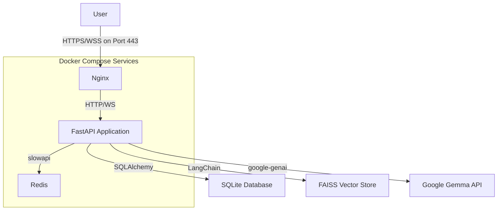

# Full-Stack Generative AI Chatbot

This repository contains the source code for a full-stack, production-ready generative AI chatbot. The application is built with a modern Python backend using FastAPI and features a complete Retrieval-Augmented Generation (RAG) pipeline, real-time streaming, multi-user support, and a secure, containerized deployment environment.

## ✨ Key Features

-   **🤖 Real-Time Conversational AI**: Engage in multi-turn conversations with the Google Gemma model, with responses streamed in real-time via WebSockets.
-   **📚 Retrieval-Augmented Generation (RAG)**: Upload your own `.pdf` and `.txt` documents to create a knowledge base that the chatbot uses to provide context-aware, accurate answers.
-   **👤 Multi-User Authentication**: Secure user registration and login system using JWT (JSON Web Tokens) for session management.
-   **⚙️ Production-Grade Backend**: Asynchronous API built with FastAPI, following modern software design principles to handle I/O-bound operations efficiently.
-   **🔒 Security & Administration**:
    -   **Admin Panel**: A secure `/admin` interface (via SQLAdmin) for managing users and conversations.
    -   **Rate Limiting**: Protects login and registration endpoints from brute-force attacks using a Redis-backed `slowapi`. 
    -   **CORS**: Properly configured Cross-Origin Resource Sharing.
-   **🚀 DevOps & Automation**:
    -   **Containerized Environment**: The entire stack (FastAPI app, Nginx, Redis) is orchestrated with Docker Compose for easy setup and deployment.
    -   **Reverse Proxy**: Nginx is configured as a reverse proxy to handle HTTPS and WebSocket traffic securely.
    -   **CI/CD Pipeline**: A complete GitHub Actions workflow automatically lints, builds, and pushes the application's Docker image to the GitHub Container Registry on every commit.

## 🛠️ Tech Stack

-   **Backend**: Python, FastAPI, SQLAlchemy (asyncio), Pydantic, Uvicorn
-   **Database**: SQLite, Redis
-   **GenAI & RAG**: Google GenAI (Gemma), LangChain, FAISS (Vector Store), Sentence-Transformers
-   **DevOps**: Docker, Docker Compose, Nginx, GitHub Actions
-   **Security**: `passlib` (hashing), `python-jose` (JWT), `slowapi` (rate limiting)
-   **Frontend**: Vanilla HTML, CSS, and JavaScript

## 🏛️ Architecture

The application runs in a multi-container Docker environment orchestrated by Docker Compose.



## 🚀 Getting Started

Follow these instructions to get the project running locally.

### Prerequisites

-   Docker
-   Docker Compose
-   A Google AI Studio API key for the Gemma model.

### 1. Clone the Repository

```bash
git clone https://github.com/Shrimpstanot/gemma_chatbot.git
cd gemma_chatbot
```

### 2. Create Environment File

Create a `.env` file in the root of the project directory. This file will store your secret keys.

```bash
touch .env
```

Open the `.env` file and add the following variables. Replace the placeholder values with your own.

```ini
# Generate a strong, random string for this.
# You can use: openssl rand -hex 32
SECRET_KEY=your_super_secret_key_here

# Your API key from Google AI Studio
GEMMA_API_KEY=your_gemma_api_key_here

# Redis connection URL for Docker Compose
REDIS_URL=redis://redis:6379/0

# These can remain as they are
ALGORITHM=HS256
ACCESS_TOKEN_EXPIRE_MINUTES=30
```

### 3. Build and Run the Containers

Use Docker Compose to build the images and start all the services in detached mode.

```bash
docker-compose up --build -d
```

This command will:
1.  Build the Docker image for the FastAPI application.
2.  Pull the official `nginx` and `redis` images.
3.  Start all three containers and connect them on a shared network.

### 4. Initialize the Database

The first time you run the application, you need to create the database tables. Execute the `init_db.py` script inside the running `app` container.

```bash
docker-compose exec app python init_db.py
```

Your application stack is now fully running!

## Usage

-   **Main Application**: Access the chatbot by navigating to `https://localhost` in your browser. (Note: You may need to accept the self-signed SSL certificate warning).
-   **User Registration**: Create a new account via the `/register` page.
-   **Admin Panel**: Log in as a user that you have marked as `is_admin=True` in the database. Access the admin panel at `https://localhost/admin`.

## 🔄 CI/CD Pipeline

This project uses a GitHub Actions workflow (`.github/workflows/ci-cd.yml`) to automate integration and deployment. On every push to the `main` branch, the workflow will:

1.  **Set up Environment**: Check out the code and set up a Python environment.
2.  **Install Dependencies**: Install all required Python packages.
3.  **Lint Code**: Run `ruff` to check for code quality and style errors.
4.  **Build & Push**: If linting succeeds, it builds the application's Docker image and pushes it to the GitHub Container Registry, tagged with the commit SHA.

## License

This project is licensed under the MIT License.
